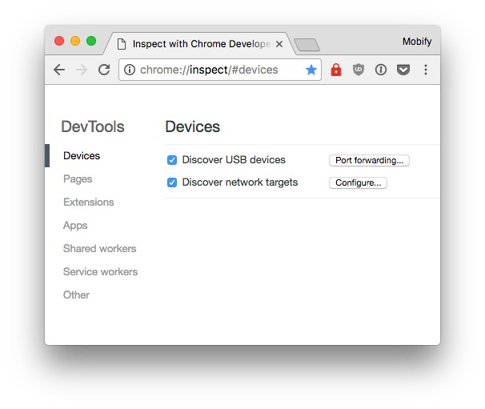
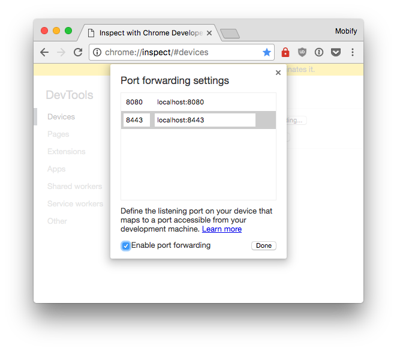

## Requirements

- [Git](https://git-scm.com/)
- We recommend you use [nvm](https://github.com/creationix/nvm#installation) to
manage node and npm versions.
- node 6.x LTS
- npm 3.x

## Setup

```
npm install
npm run dev
```

## Adding a page (container)

```
npm run add:page
```

## Adding a component

```
npm run add:component
```

## Using the notification system

The scaffold comes with a system to notify users with messages that drop down
from the header, and can be dismissed. To make your own, add the following code
to the actions file of your component in the desired action. Example:

```
dispatch(addNotification({
    content: 'The notification message.',
    id: 'uniqueIdForTheNotification',
    showRemoveButton: true
}))
```

## Docs with Styleguide

To run the project documentation, including a live styleguide, use:

```
npm run docs:dev
```

## SVG Images and Icons

The SVG directory can be found in `app/static/svg/`. There are three purposes for this directory:

1. Store any **static SVG images**
    * These are stored in the `app/static/svg/` directory's root. These files are ignored by the SVG optimization task (for now).
2. Store **icon source files**
    * These are stored in the `app/static/svg/sprite-source/` directory and are the targets for the SVG optimization and Sprite building tasks.
3. Store the **generated icon sprite**
    * This is stored in the `app/static/svg/sprite-dist` directory as the destination for the generated icon sprite.

When adding, removing or modifying SVG icons, it is up to the developer to run the following command to generate the new SVG sprite sheet and commit the change.

```
npm run build-sprites
```

Icon sprites are a technique for creating easy to use icons. [Learn more here](https://medium.com/@webprolific/why-and-how-i-m-using-svg-over-fonts-for-icons-7241dab890f0#.1v9l7c7q2) about the technique and why we use it over icon fonts.

## Tests

To run the full test suite, you can use:

```
npm run test:all
```

To run tests in watch mode and only run test related to files you modify during development, use:

```
npm run test:watch
```

## SSL

### Prevent SSL Errors in Preview (on a Mac)

The development server uses a self-signed SSL certificate which is
valid, but treated as suspect by browsers. This means that we must
create and reconfirm security exceptions for it, and avoid localhost
for certain use cases (such as service workers).

To add the certificate to the Mac system trust store and make the
browsers accept it, do the following:

1. In the root of the project directory, run `open node_modules/webpack-dev-server/ssl/server.crt`.
2. Open `Keychain Access` -> go to `Certificates` -> select `localhost`
3. Right click on the entry and select `Get Info`
4. Expand the `Trust` section
5. Set `Secure Socket Layer (SSL)` to `Always Trust`
6. Close the info window. You will need to enter your password.

This process will allow all projects hosted with `webpack-dev-server`
version 1.15.0 and up to be trusted by your browsers.

### Previewing on a device

When you preview on a real device, or on the Android emulator, you are
connecting from a "remote" computer. Even the Android emulator is a separate
computer with its own IP. In order for your device to trust the SSL cert
that the webpack dev server uses, you'll need to use Chrome port forwarding.

_Note_: The webpack dev server uses a self-signed certificate for `localhost`
        which cannot be trusted when connecting to it using your local
        computer's IP address (ie. 192.168.2.2). Because of this you *have*
        to use Chrome port forwarding to connect to the webpack dev server
        from an Android device.

To set this up, do the following:

1. Open chrome on the computer running the webpack dev server
2. Navigate to `chrome://inspect`

   

3. Click the **Port Forward** button beside the *Discover USB devices* checkbox
4. Add a new entry mapping port **8443** to **localhost:8443** and hit <Enter>
5. Make sure the checkbox **Enable port forwarding** at the bottom of the modal is checked

   

6. Click **Done**

You can now preview on your Android device and use `https://localhost:8443/...`

## Tests

To run the full test suite, you can use:

```
npm run test:all
```

To run tests in watch mode and only run test related to files you modify during development, use:

```
npm run test:watch
```

## Automated end-to-end tests

To verify that changes do not break the checkout flow:

```
npm run smoke-test
```

## Lighthouse tests

You can run [Lighthouse](https://github.com/GoogleChrome/lighthouse) test against production with:

```
npm run test:pwa-prod
```

When you develop it might be helpful to run the same test against your local files:

```
sudo npm run test:pwa-local
```

You **must** keep running `npm run dev` at the same time.

There is also `test:pwa-ci` task (also requires `sudo`) for CI that runs `dev` and `pwa-local` in parallel.

## Developing against `develop` of the Progressive Web SDK

If you are wanting to improve or add a library/component in the [Progressive Web SDK](https://github.com/mobify/progressive-web-sdk),
you will need to clone the SDK (note: it is not open on Github).

```
git clone git@github.com:mobify/progressive-web-sdk.git
cd progressive-web-sdk
npm link
```

Then navigate back to your project root directory and run:
```
npm link progressive-web-sdk
```
